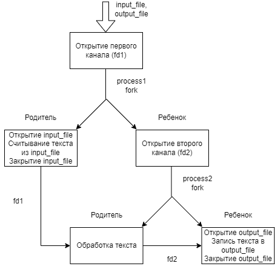

# Работа на 4

### Запуск
Программа компилируется через
```c
gcc 4.c
```
При запуске необходимо указать имена входного и выходного файлов как аргументы командной строки. Входные файлы желательно помещать в директории `/input` и `/output`

**Пример**:
```c
./a.out input/1.txt output/1.txt
```

### Описание

