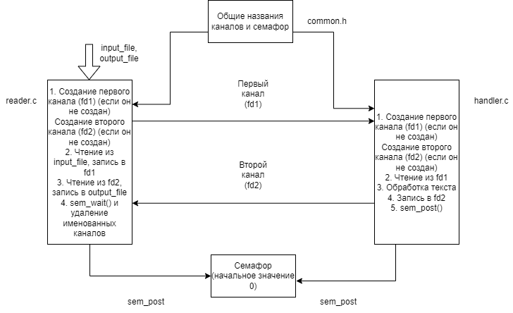

# Работа на 8

### Запуск
Программа компилируется через два терминала

В первом
```c
gcc reader.c -o read
```
Во втором
```c
gcc handler.c -o handle
```

При запуске необходимо указать имена входного и выходного файлов как аргументы командной строки у `read`. Входные файлы желательно помещать в директории `/input` и `/output`

Запускать `handle` и `read` можно в любом порядке

**Пример**:
```c
./read input/1.txt output/1.txt
```
```c
./handle
```

### Описание
В программе используется семафор для корректного удаления именованных каналов


