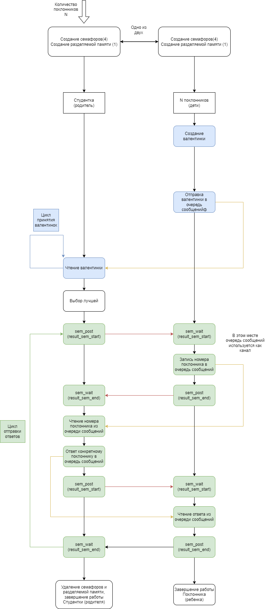

# Работа на 10

Используются UNIX SYSTEM V семафоры и UNIX SYSTEM V очередь сообщений

### Запуск
Программа компилируется через Makefile
```bash
make
```
При запуске `beauty` необходимо указать количество поклонников (дочерних процессов)

Предполагается, что будет запущено столько `admirer`ов, сколько было указано при запуске `beauty`

Весь вывод идёт в консоль

**Пример**:
```c
./beauty 5
./admirer x5
```

### Описание

Из цикла принятия валентинок убраны семафоры, так там там используется очередь сообщений. В цикле отправки ответов семафоры оставлены, очередь сообщений там используется как двусторонний канал


