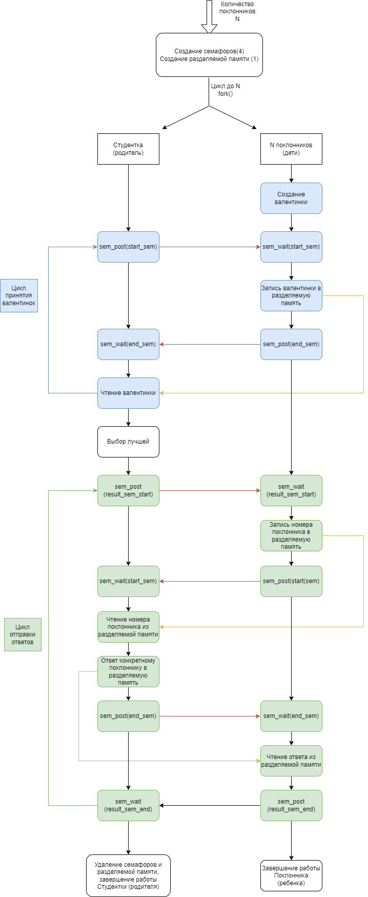

# Работа на 4

Используются именованные POSIX семафоры и POSIX разделяемая память

### Запуск
Программа компилируется через Makefile
```bash
make
```
При запуске необходимо указать количество поклонников (дочерних процессов)

Весь вывод идёт в консоль

**Пример**:
```c
./4 5
```

### Описание

