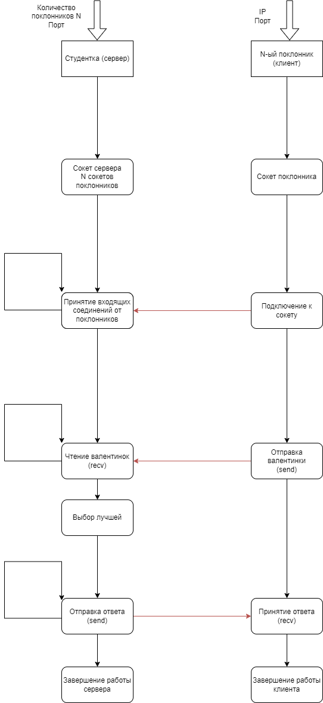

# Работа на 4-5

TCP соединение, клиент и сервер самостоятельно выводят информацию о себе.

Красивая студентка знает сколько у неё поклонников и ждёт валентинки от каждого из них. Когда все валентинки приходят, она выбирает самую впечатляющую и уведомляет автора о своём согласии пойти с ним на свидание. Другим поклонникам она посылает сообщение об отказе.

### Запуск
Программа компилируется через Makefile
```bash
make
```
Создаётся сервер и три клиента. Если необходимо создать большее число клиентов, то это можно сделать через
```bash
gcc admirer.c common.h -o admirer
```
Преполагается, что вначале будет запущен сервер `beauty`, с аргументами в виде порта и количества поклонников `admirer` (клиентов). Если запустить клиента раньше сервера, то он в течении 10 секунд будет пытаться установить соединение, а затем завершиться.

**Пример**:
```c
./beauty 5000 3
./admirer 127.0.1.1 5000
```

### Описание

