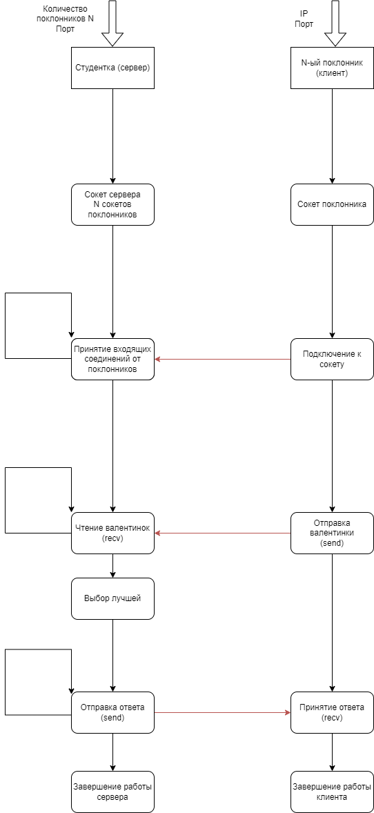

# Работа на 4-5

UDP соединение, клиент и сервер самостоятельно выводят информацию о себе.

Красивая студентка знает сколько у неё поклонников и ждёт валентинки от каждого из них. Когда все валентинки приходят, она выбирает самую впечатляющую и уведомляет автора о своём согласии пойти с ним на свидание. Другим поклонникам она посылает сообщение об отказе.

### Запуск
Программа компилируется через Makefile
```bash
make
```

Преполагается, что вначале будет запущен сервер `beauty`, с аргументами в виде порта и количества поклонников `admirer` (клиентов).

**Пример**:
```c
./beauty 5000 3
./admirer 127.0.1.1 5000
```

### Описание
Схема аналогична TCP-соединению, за исключением того, что клиент и сервер не устанавливают соединение между собой, а сразу отправляют сообщения.


