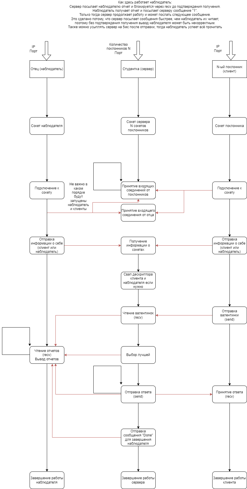

# Работа на 6-7

tldr; Порядок запуска: `beauty`, `father`, `admirer`

UDP соединение, клиент и сервер самостоятельно выводят информацию о себе + один наблюдатель.
Вывод информации о себе у сервера и клиента оставлен для сравнения.

Красивая студентка знает сколько у неё поклонников и ждёт валентинки от каждого из них. Когда все валентинки приходят, она выбирает самую впечатляющую и уведомляет автора о своём согласии пойти с ним на свидание. Другим поклонникам она посылает сообщение об отказе.
Еще у студентки есть строгий отец, который следит за каждым его шагом и очень не любит её ухажеров, поэтому она вынуждена отчитываться ему о каждом своём действии.

### Запуск
Программа компилируется через Makefile
```bash
make
```
Создаётся сервер и три клиента. Если необходимо создать большее число клиентов, то это можно сделать через
```bash
gcc admirer.c common.h -o admirer
```
Преполагается, что вначале будет запущен сервер `beauty`, с аргументами в виде порта и количества поклонников `admirer` (клиентов), затем `father`, затем `admirer`

**Пример**:
```c
./beauty 5000 3
./father 127.0.1.1 5000
./admirer 127.0.1.1 5000
```

### Описание
Приведена схема из прошлой TCP работы.

Схема аналогична TCP-соединению, за исключением того, что клиент и сервер не устанавливают соединение между собой, а сразу отправляют сообщения. Также наблюдатель не подтверждает получения сообщений. Можно сказать, что TCP программа упрощена.


